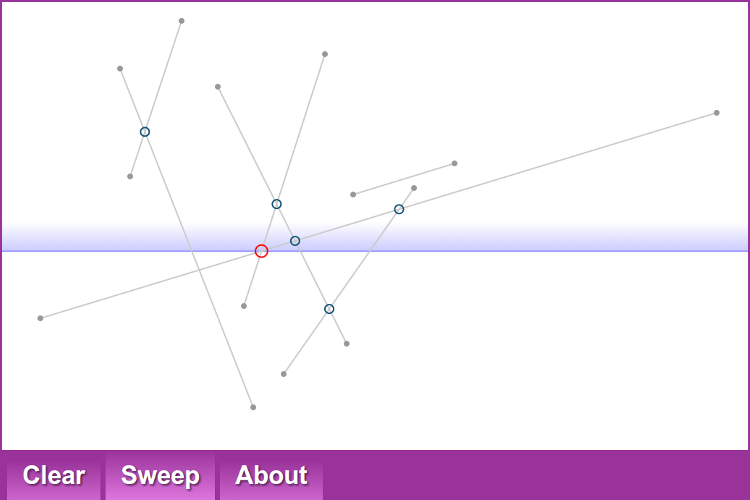

sweep.js
========

### SVG simulation of a sweep line algorithm for line segment intersection ###

[View the simulation](http://daign.github.io/sweep.js/src/)

Licensed under [MIT License](https://github.com/daign/sweep.js/blob/master/LICENSE.txt)

Dependencies:
* [js_cols](https://code.google.com/p/jscols)
* [tween.js](https://github.com/sole/tween.js)
* requestAnimationFrame from [three.js](https://github.com/mrdoob/three.js)

